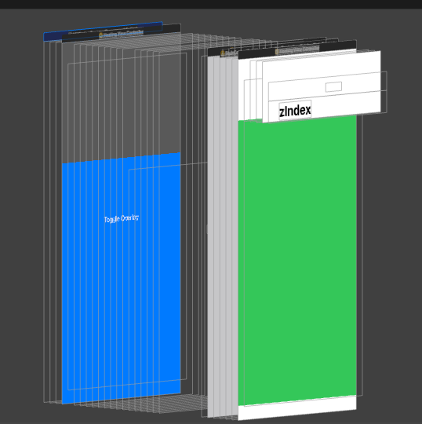

# zIndex with NavigationView

## Problem

When using a NavigationView the `zIndex` is applied visually but not in the view inspector.

## Motivation

We have currently views in our app that have visibility set to false when showing an overlay due to the interpretation of the screen. On the screen it is visible but accessibility says otherwise.

## Related Code Snippet

```
ZStack(alignment: .bottom) {
    NavigationView {
        Color.green
            .navigationTitle("zIndex")
    }                
    .zIndex(1)
    
    if isShowingOverlay {
        overlayView
            .zIndex(2)
    }
}
```

## Screenshots


